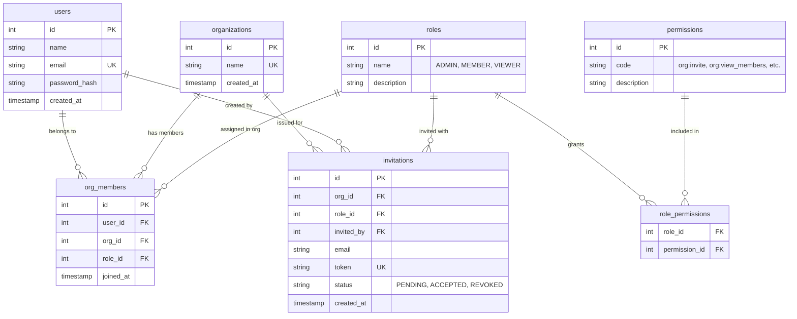

# RemoAsset Multi-Tenant Organization & Team Management Platform

A production-grade implementation of **Multi-Tenancy**, **Role-Based Access Control (RBAC)**, and **Team Invitation Flow** built with Next.js (App Router), TypeScript, Tailwind CSS, and PostgreSQL (Docker Alpine).

---

## 🚀 Quick Start (Under 1 Minute)

### 1. Start the PostgreSQL Alpine Database
```bash
docker compose up -d
```
The database runs on port `5433` using the `postgres:16-alpine` image and automatically runs `init.sql` to set up tables, roles, and permissions.

### 2. Install & Start Next.js
```bash
npm install
npm run dev
```
Open [http://localhost:3001](http://localhost:3001) in your browser.

---

## ⚡ Pre-Configured Demo Accounts (1-Click Login)

On the login page, you can use one-click buttons or log in manually:

| Account | Email | Password | Role & Scope |
| :--- | :--- | :--- | :--- |
| **Alice Admin** | `alice@example.com` | `password123` | **ADMIN** in *Acme Corporation* (Can invite, remove members, manage roles) |
| **Bob Member** | `bob@example.com` | `password123` | **MEMBER** in *Acme Corporation* (Read-only access; invite restricted by RBAC) |
| **Charlie Multi-Org** | `charlie@example.com` | `password123` | **MEMBER** in *Acme Corp* & **ADMIN** in *Beta Logistics* |

---

## 🏛️ Database Schema (7 Tables - Full RBAC)



### Why this design is correct:
1. **Many-to-Many Isolation:** `users` does NOT store `org_id`. Instead, `org_members` links a user to multiple organizations.
2. **Context-Specific Roles:** A user can be an `ADMIN` in Org A and a `MEMBER` in Org B.
3. **Dedicated Invitations Table:** Prospective members don't need existing accounts. Admin only enters `email` and `role`. The recipient clicks the invite link and sets their own password.
4. **Enforced RBAC:** Permissions (`org:invite`, `org:remove_member`, `org:manage_roles`) are tied to roles and enforced in both API middleware and frontend UI.

---

## 🛠️ REST API Endpoints

### Authentication
* `POST /api/auth/signup` - Register user & automatically create organization with Admin role
* `POST /api/auth/login` - Verify credentials & issue HTTP-only JWT cookie
* `POST /api/auth/logout` - Clear session cookie
* `GET /api/auth/me` - Get current session profile

### Organizations & Members
* `GET /api/organizations` - List all organizations current user belongs to with role & permissions
* `POST /api/organizations` - Create a new organization
* `GET /api/organizations/:orgId/members` - List active organization members
* `DELETE /api/organizations/:orgId/members/:memberId` - Remove member (`org:remove_member` permission required)
* `PATCH /api/organizations/:orgId/members/:memberId` - Update member role (`org:manage_roles` permission required)

### Invitations Flow
* `GET /api/organizations/:orgId/invitations` - List pending invitations for organization
* `POST /api/organizations/:orgId/invitations` - Create invitation link (`org:invite` permission required)
* `DELETE /api/organizations/:orgId/invitations/:inviteId` - Revoke invitation
* `GET /api/invitations/:token` - Validate public invitation link
* `POST /api/invitations/:token` - Accept invitation and onboard member
